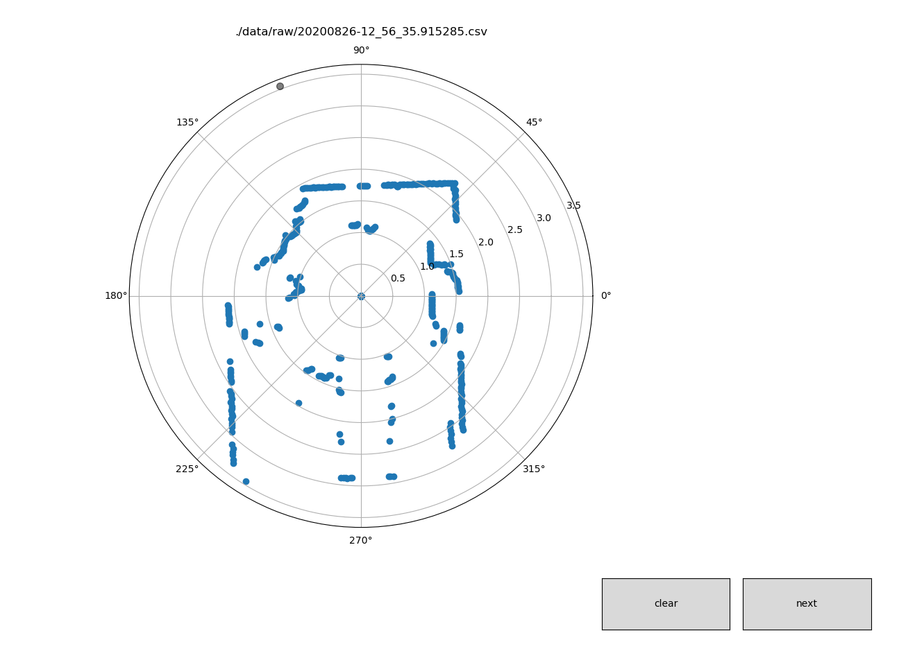

# lidar_tool_label
python3

:warning:
For the moment you can select only one dots group, the data extract can be only used to detect only one object no more.

## Use it 

### Store data 
The script extract all csv from **./data/raw/** folder. 
Please insert all your csv in this folder. 

The **./data/processed/** folder stores all data generated by the script. 

## Screenshots

